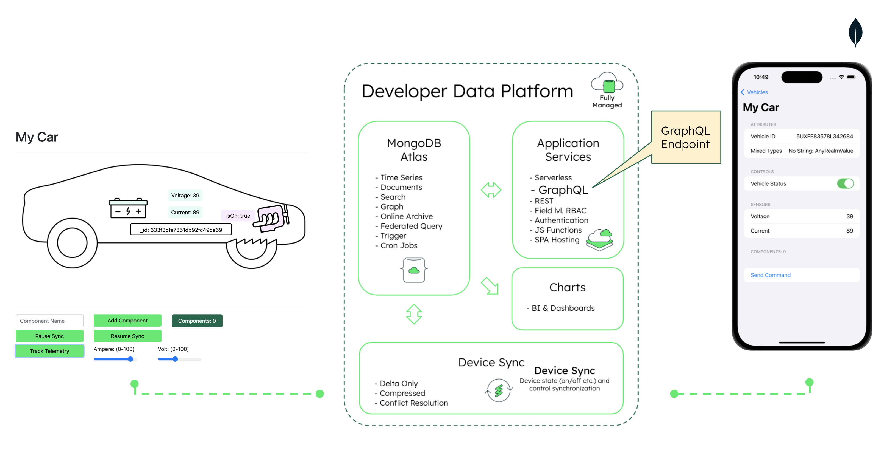

# MongoDB Connected Vehicle End to End Demo Repository
Code samples and demos around using the Realm database in combination with MongoDB Atlas, Edge Server, Device Sync and AWS Sagemaker.

[Demo Video](https://youtu.be/AlGeTg1RAUI)



## MongoDB Atlas Backend Setup

[Setup MongoDB Atlas Backend](https://github.com/mongodb-industry-solutions/connected-devices/tree/main/atlas-backend)

## Typescript Vehicle Simulator

[Setup Device Simulator](https://github.com/mongodb-industry-solutions/connected-devices/tree/main/device-ts)

## iOS Swift Vehicle Controller Mobile App

[Setup iOS Mobile Application](https://github.com/mongodb-industry-solutions/connected-devices/tree/main/mobile-swift)


## Edge Server Setup

To install and configure Edge Server, follow the instructions here: https://www.mongodb.com/docs/atlas/app-services/edge-server/configure/
Since Edge Server is currently in private preview, you need to request an access Token. To request it, please visit: https://www.mongodb.com/products/platform/atlas-edge-server
When Edge Server is installed, go to the `edge_server` folder and make sure the file `config.json` has the following structure:

```
{
  "clientAppId": "<your APP ID>",
  "query": {
    "Vehicle": "truepredicate",
    "Component":"truepredicate",
    "Sensor":"truepredicate"  
  },
  "cloudSyncServerAuthSecret": <<YOUR_TOKEN>>,
  "hostname": "localhost:80",
  "tls" : {
    "enabled": false,
    "certificates": [
      {
        "publicKeyPath": "certs/cert.pem",
        "privateKeyPath": "certs/certkey.pem"
      }
    ]
  }
}
```


## AWS Sagemaker Integration (WIP)

[Setup AWS Sagemaker Integration](https://github.com/mongodb-industry-solutions/connected-devices/tree/main/aws-sagemaker)
