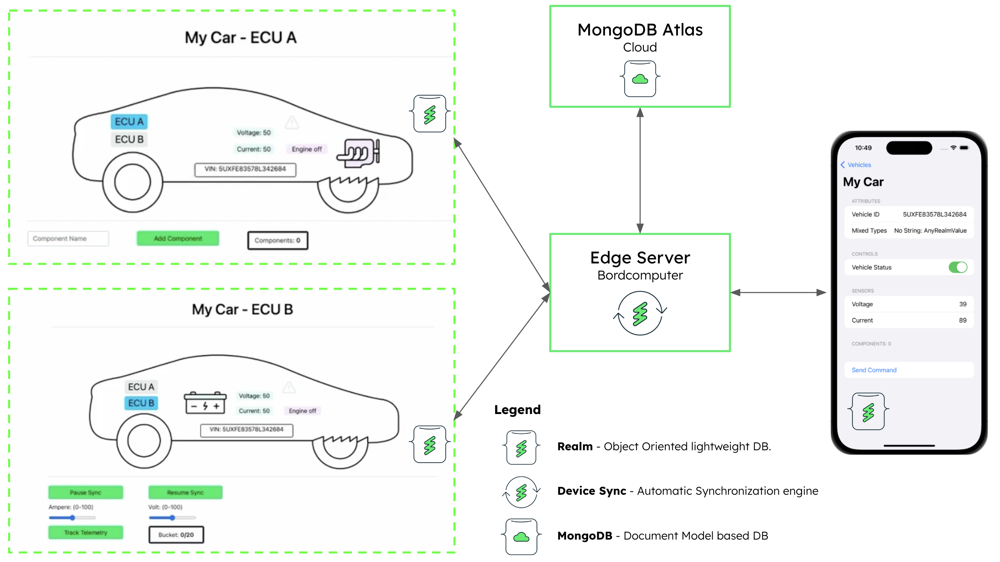

# MongoDB Connected Vehicle End to End Demo Repository
Code samples and demos around using the Realm database in combination with MongoDB Atlas, Edge Server, Device Sync and AWS Sagemaker.

[Demo Video](https://www.youtube.com/watch?v=6qodPDPNoSg)

## MongoDB Atlas Backend Setup

[Setup MongoDB Atlas Backend](https://github.com/mongodb-industry-solutions/connected-devices/tree/main/atlas-backend)

## Typescript Vehicle Simulator

[Setup Device Simulator](https://github.com/mongodb-industry-solutions/connected-devices/tree/main/device-ts)

## iOS Swift Vehicle Controller Mobile App

[Setup iOS Mobile Application](https://github.com/mongodb-industry-solutions/connected-devices/tree/main/mobile-swift)

## AWS Sagemaker Integration (WIP)

[Setup AWS Sagemaker Integration](https://github.com/mongodb-industry-solutions/connected-devices/tree/main/aws-sagemaker)
